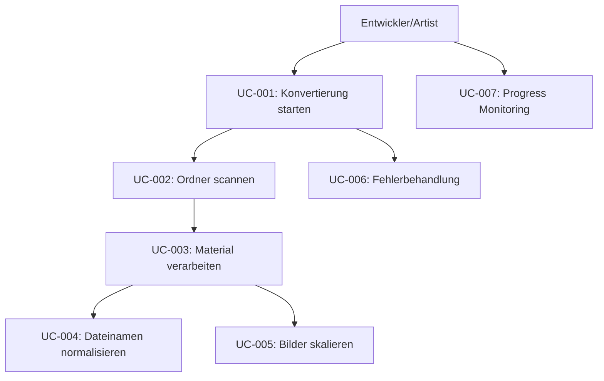

# Use Cases - PBR Material Dump Tool

## Übersicht
Diese Dokumentation beschreibt alle Use Cases für das PBR Material Dump Tool - ein **funktionierendes, stabiles** Programm zur Konvertierung hochauflösender PBR-Materialien. Focus liegt auf **pragmatischen Verbesserungen** statt Over-Engineering.

## UC-001: PBR Material Konvertierung starten
**Akteure:** Entwickler, Artist
**Beschreibung:** Startet den Konvertierungsprozess für PBR-Materialien
**Vorbedingungen:** 
- MaterialDumpTool.exe ist verfügbar
- Workspace-Verzeichnis mit PBR-Materialien existiert

**Hauptszenario:**
1. Nutzer öffnet Kommandozeile
2. Nutzer führt Befehl aus: `START MaterialDumpTool.exe --dir PATH_TO_WORKSPACE`
3. System validiert das angegebene Verzeichnis
4. System startet Konvertierungsprozess
5. System zeigt Fortschritt in der Konsole an

**Alternativszenarios:**
- 1a: Pfad nicht angegeben → System verwendet aktuelles Verzeichnis
- 3a: Verzeichnis existiert nicht → Fehlermeldung wird angezeigt
- 1b: --verbose Flag → Detailliertes Logging aktiviert  
- 1c: --help Parameter → Zeigt Hilfe-Information und beendet sich

## UC-002: PBR Material-Ordner scannen
**Akteure:** System
**Beschreibung:** Durchsucht das Workspace-Verzeichnis nach PBR-Material-Ordnern
**Vorbedingungen:** Workspace-Verzeichnis ist verfügbar

**Hauptszenario:**
1. System durchsucht Workspace-Verzeichnis
2. System identifiziert alle Unterordner (ausgenommen "_dump")
3. System prüft jeden Ordner auf PNG-Dateien
4. System listet gefundene Material-Ordner auf

## UC-003: Einzelnen Material-Ordner verarbeiten
**Akteure:** System
**Beschreibung:** Verarbeitet einen einzelnen PBR-Material-Ordner
**Vorbedingungen:** Material-Ordner mit PNG-Dateien existiert

**Hauptszenario:**
1. System erstellt "_dump/[material-name]" Verzeichnis
2. System prüft auf vorhandene Bilder im Quellordner
3. System erstellt "2048x2048" Unterverzeichnis
4. System kopiert alle PNG-Dateien in das 2048x2048 Verzeichnis
5. System normalisiert Dateinamen
6. System erstellt skalierte Versionen (8x8 bis 1024x1024)

**Alternativszenarios:**
- 2a: Keine PNG-Dateien gefunden → Ordner wird übersprungen
- 4a: Kopiervorgang fehlgeschlagen → Fehler wird geloggt, Verarbeitung kontinuiert
- 5a: Async-Verarbeitung → Multiple Materialien parallel verarbeitet

## UC-004: Dateinamen normalisieren
**Akteure:** System
**Beschreibung:** Vereinheitlicht inkonsistente Dateinamen nach definierten Regeln
**Vorbedingungen:** PNG-Dateien mit verschiedenen Namenskonventionen

**Hauptszenario:**
1. System durchsucht alle PNG-Dateien im Verzeichnis
2. System wendet Normalisierungsregeln an:
   - Konvertierung zu Kleinbuchstaben
   - Ersetzung von "-" durch "_" in Suffixen
   - "roughnessmetalness" → "metalRoughness"
3. System benennt Dateien entsprechend um
4. System loggt alle Änderungen

## UC-005: Bildauflösung skalieren
**Akteure:** System
**Beschreibung:** Erstellt skalierte Versionen der PBR-Texturen in verschiedenen Auflösungen
**Vorbedingungen:** 2048x2048 Quellbilder sind verfügbar

**Hauptszenario:**
1. System iteriert durch Zielauflösungen (8, 16, 32, 64, 128, 256, 512, 1024)
2. Für jede Auflösung:
   - System erstellt entsprechenden Ordner
   - System lädt jedes Quellbild (2048x2048)
   - System skaliert Bild auf Zielauflösung
   - System speichert skaliertes Bild

**Alternativszenarios:**
- 2a: Skalierung fehlgeschlagen → Einzelne Datei übersprungen, Verarbeitung kontinuiert
- 2b: Async-Processing → Mehrere Auflösungen parallel skaliert

## UC-006: Fehlerbehandlung
**Akteure:** System
**Beschreibung:** Behandlung von Fehlern während des Konvertierungsprozesses
**Vorbedingungen:** Fehler tritt während der Verarbeitung auf

**Hauptszenario:**
1. System erkennt Exception
2. System loggt Fehlermeldung mit Timestamp
3. System versucht Verarbeitung fortzusetzen (graceful degradation)
4. System beendet sich nur bei kritischen Fehlern (OutOfMemory, etc.)

## UC-007: Progress Monitoring
**Akteure:** Benutzer
**Beschreibung:** Überwachung des Konvertierungsfortschritts
**Vorbedingungen:** Konvertierungsprozess läuft

**Hauptszenario:**
1. System zeigt Progress Counter (X/Y Materialien)
2. System zeigt aktuell verarbeiteten Ordner mit Timestamp
3. System zeigt Details nur bei --verbose Flag
4. System zeigt Abschluss-Statistiken (Erfolg/Fehler Count)
5. System beendet sich automatisch (außer bei Debugger)

## Use Case Diagramm

## Datenfluss zwischen Use Cases

1. **UC-001** → **UC-002**: Workspace-Pfad
2. **UC-002** → **UC-003**: Liste der Material-Ordner
3. **UC-003** → **UC-004**: PNG-Dateien im Verzeichnis
4. **UC-003** → **UC-005**: Normalisierte 2048x2048 Dateien
5. **UC-006**: Wird von allen anderen Use Cases aufgerufen
6. **UC-007**: Läuft parallel zu allen anderen Use Cases